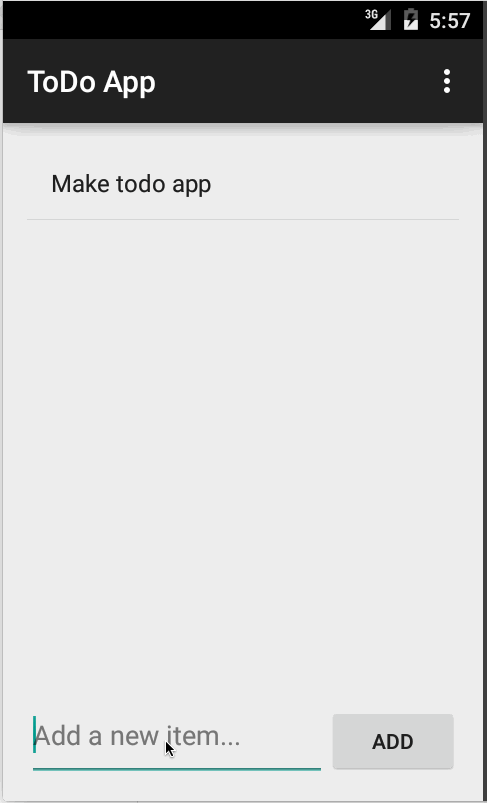
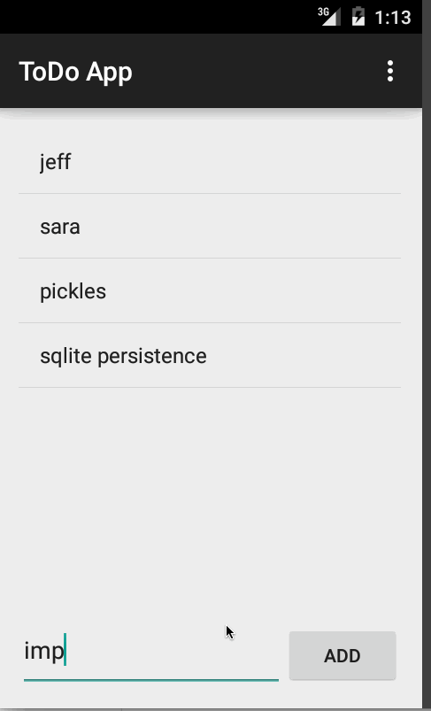

# Pre-work - *ToDo App*

**ToDo App** is an android app that allows building a todo list of basic todo items. Management functionality includes adding new items, as well as editing and deleting existing items.

Submitted by: **Jeff Martinez**

Time spent: ~**7** hours spent in total

## User Stories

The following **required** functionality is completed:

* [X] User can **successfully add and remove items** from the todo list
* [X] User can **tap a todo item in the list and bring up an edit screen for the todo item** and then have any changes to the text reflected in the todo list.
* [X] User can **persist todo items** and retrieve them properly on app restart

The following **optional** features are implemented:

* [X] Persist the todo items [into SQLite](http://guides.codepath.com/android/Persisting-Data-to-the-Device#sqlite) instead of a text file
* [ ] Improve style of the todo items in the list [using a custom adapter](http://guides.codepath.com/android/Using-an-ArrayAdapter-with-ListView)
* [ ] Add support for completion due dates for todo items (and display within listview item)
* [ ] Use a [DialogFragment](http://guides.codepath.com/android/Using-DialogFragment) instead of new Activity for editing items
* [ ] Add support for selecting the priority of each todo item (and display in listview item)
* [ ] Tweak the style improving the UI / UX, play with colors, images or backgrounds

The following **additional** features are implemented:

* [X] Show a toast after an edit to show the old and new task names.

## Video Walkthrough 

Here's a walkthrough of implemented user stories:

With required functionality:

With additional functionality:

GIFs created with [LiceCap](http://www.cockos.com/licecap/).

## Notes

### Challenges encountered

* I had to troubleshoot an exception when I first added persistence to the app. When the app fires up and there is no existing file there was a null pointer exception. I added some basic code to handle this.
* The method of persistence for the basic app has a bug. Since it just writes the ArrayList to a file, one element per line, multiline tasks are read back as multiple single line tasks. I'll be fixing this when I use SQLite for persistence. (Update: This has been fixed).
* I forgot the `.show()` on one of my toasts when I was experimenting. It took me a little while figure out what was wrong :p

## License

    The MIT License (MIT)

	Copyright (c) 2015 jeff martinez
	
	Permission is hereby granted, free of charge, to any person obtaining a copy
	of this software and associated documentation files (the "Software"), to deal
	in the Software without restriction, including without limitation the rights
	to use, copy, modify, merge, publish, distribute, sublicense, and/or sell
	copies of the Software, and to permit persons to whom the Software is
	furnished to do so, subject to the following conditions:
	
	The above copyright notice and this permission notice shall be included in all
	copies or substantial portions of the Software.
	
	THE SOFTWARE IS PROVIDED "AS IS", WITHOUT WARRANTY OF ANY KIND, EXPRESS OR
	IMPLIED, INCLUDING BUT NOT LIMITED TO THE WARRANTIES OF MERCHANTABILITY,
	FITNESS FOR A PARTICULAR PURPOSE AND NONINFRINGEMENT. IN NO EVENT SHALL THE
	AUTHORS OR COPYRIGHT HOLDERS BE LIABLE FOR ANY CLAIM, DAMAGES OR OTHER
	LIABILITY, WHETHER IN AN ACTION OF CONTRACT, TORT OR OTHERWISE, ARISING FROM,
	OUT OF OR IN CONNECTION WITH THE SOFTWARE OR THE USE OR OTHER DEALINGS IN THE
	SOFTWARE.
